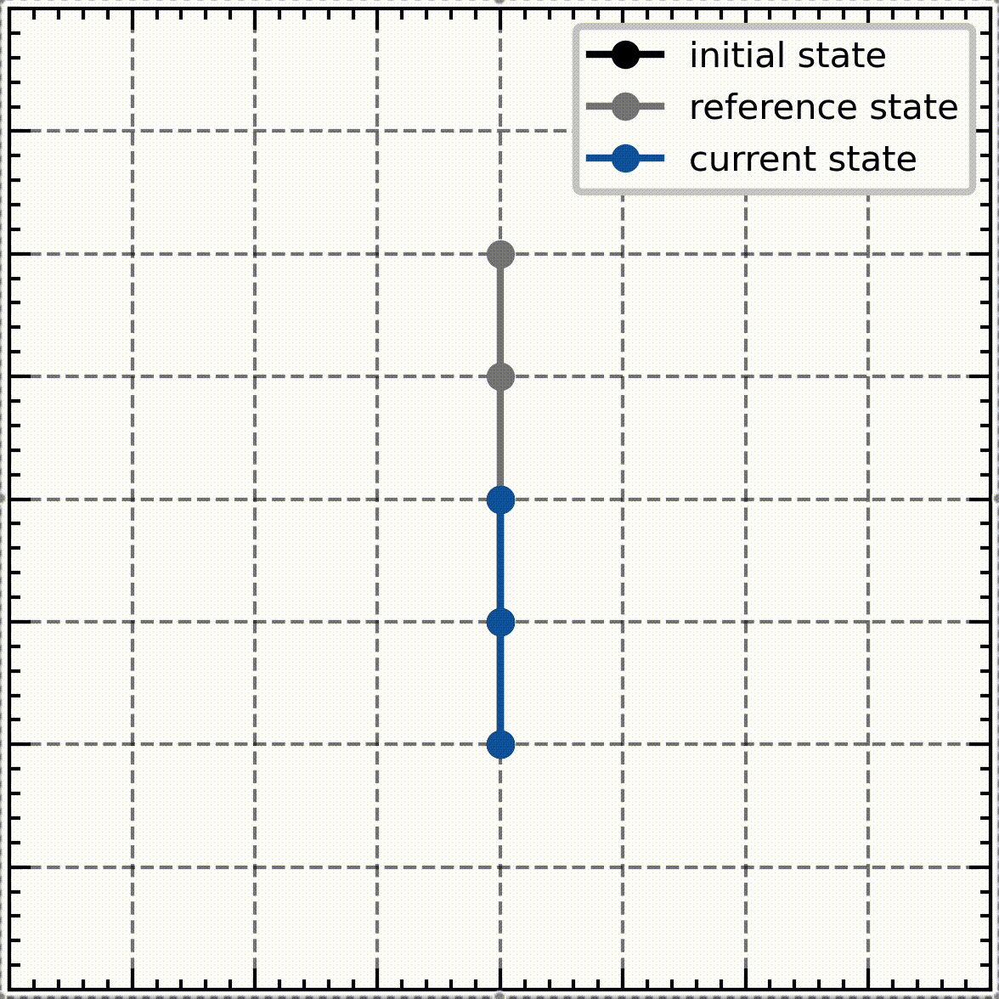

# Double Pendulum Control with LQR and MPC

## Abstract
This project explores the modeling and control of a double pendulum system using Linear Quadratic Regulator (LQR) and Model Predictive Control (MPC). The study includes deriving system dynamics, discretizing them using Runge-Kutta integration, and implementing control strategies to stabilize the system. The effectiveness of these controllers is evaluated under different scenarios, including disturbances and noise, as well as performing complex motions like swing-up. The results highlight the trade-offs between LQR and MPC in terms of stability and control effort.

## Swing-Up Demonstration
|LQR | MPC |
|---|---|
|  |  |
|States|
| |  |
|Controls|
| |  |

## Contents
- **Modeling**: Derivation of system dynamics and validation through test cases.
- **Linearization and LQR**: Linearizing the system and implementing LQR for stabilization.
- **Convex MPC**: Formulating and solving the MPC problem for improved tracking performance.
- **Simulation Results**: Evaluating the controllers in various scenarios.

---
For a detailed explanation, refer to the full report included in this repository.

